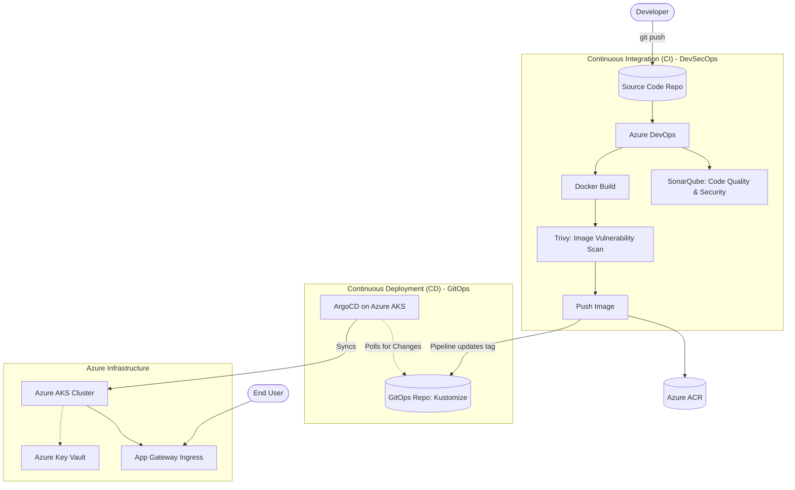

  <h1>Cloud DevOps & Microservices Capstone Project</h1>
  
<i>An Enterprise-Grade DevSecOps Pipeline on Azure</i>

  
  
  
  

 

## 📖 Problem Statement

Modern web applications require high availability, rapid release cycles, and resilience against regional or cloud-provider failures. A monolithic application deployed to a single cloud provider cannot meet these strict enterprise requirements. 

**The Goal:** Modernize a microservices-based e-commerce application by migrating it to a highly scalable cloud architecture (Azure) while implementing fully automated, secure, and observable **DevSecOps** pipelines.

---

## 🏗️ High-Level Project Overview

This project simulates a real-world enterprise infrastructure migration and CI/CD modernization effort. 

1. **Microservices Architecture:** The application consists of multiple discrete services (React Frontend, Node.js API Gateway, Auth, Orders, Products, Users) backed by a PostgreSQL database.
2. **Infrastructure-as-Code:** Infrastructure is provisioned in Azure using modular **Terraform** deployments.
3. **DevSecOps CI/CD Pipelines:** Automated pipelines (Azure DevOps) build, test, and scan code using **SonarQube** and **Trivy** before packaging them into Docker containers.
4. **GitOps Deployment:** **ArgoCD** continuously monitors the repository and synchronizes the Kubernetes clusters (AKS) to the desired state defined by **Kustomize** manifests.
5. **Observability:** Centralized monitoring via **Prometheus** and **Grafana** alongside centralized logging ensures immediate visibility into system health.

---

## ⚙️ Tech Stack & DevSecOps Tools

| Category | Technology | Purpose |
| :--- | :--- | :--- |
| **Frontend** | React | User Interface |
| **Backend** | Node.js / Express | Microservices API |
| **Database** | PostgreSQL | Relational Database (RDS / Flexible Server) |
| **Containerization**| Docker | Application packaging |
| **Orchestration** | Kubernetes (AKS) | Container scaling and management |
| **Infrastructure** | Terraform | Immutable Infrastructure as Code |
| **Config Management**| Ansible | Server configuration (SonarQube VM) |
| **CI/CD** | Azure DevOps| Build and push pipelines |
| **Security (Sec)** | SonarQube, Trivy | Static Code Analysis, Container Vulnerability Scanning |
| **GitOps** | ArgoCD, Kustomize | Continuous Deployment and drift remediation |
| **Ingress/Routing** | Azure AGIC | Layer 7 Application Load Balancing |
| **Observability** | Prometheus, Grafana | Metrics collection and visual dashboards |
| **Secrets Management**| Azure Key Vault | External Secret Stores for Kubernetes |

---

## 🔄 CI/CD & GitOps Flow Architecture

Below is a visualization of how code moves from a developer's machine into production across multiple clouds securely.

---

## 📁 Internal Documentation

For deeper technical dives into specific components of this project, please refer to the internal READMEs:

1. **[Infrastructure Configuration Guide](projects/Infrastructure/README.md):** Details the Terraform state management, modular design, and Ansible integrations for Azure.
2. **[GitOps & Kubernetes Strategy](gitops/README.md):** Explains the Kustomize overlay strategy for separating environments (`dev` vs `prod`).
