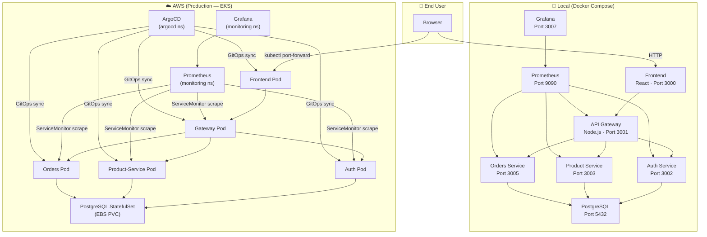
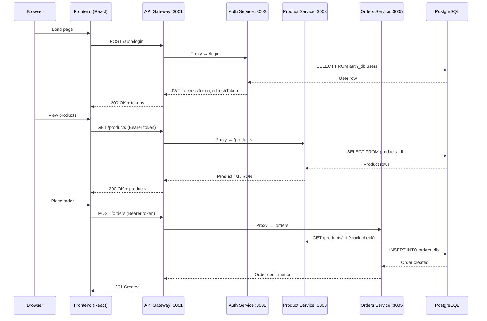
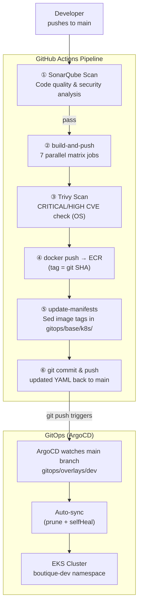
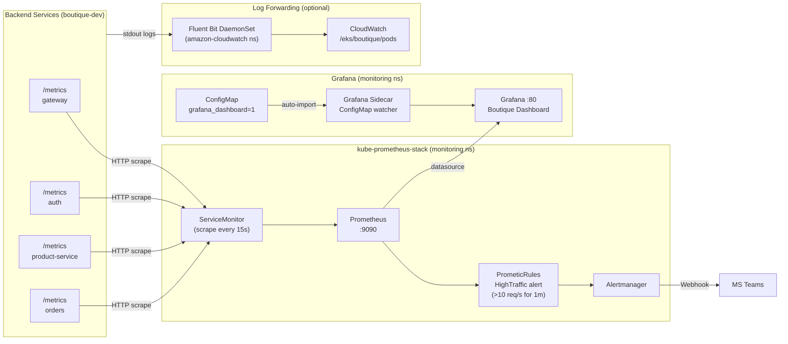
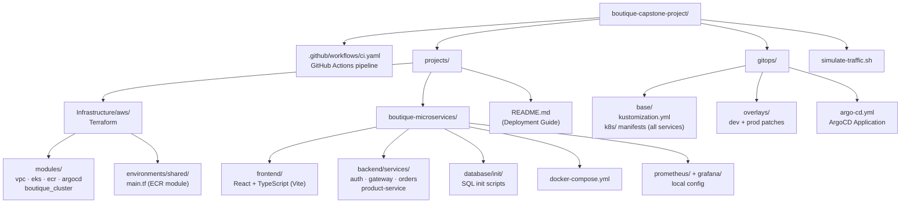
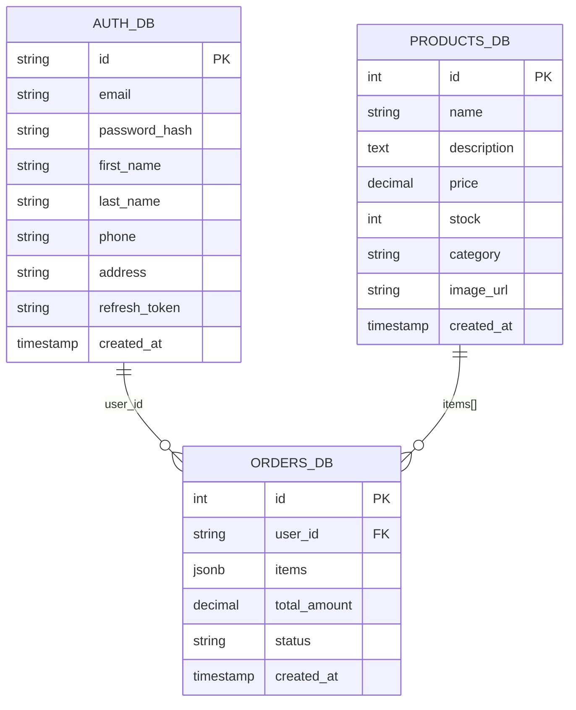
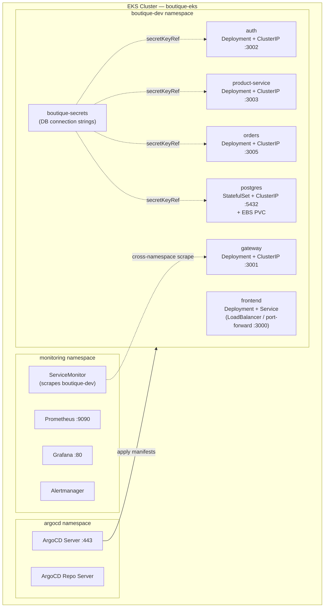

# Boutique Capstone — Architecture Diagrams

---

## 1. High-Level System Architecture

---

## 2. Microservices — Request Flow

---

## 3. Infrastructure — AWS Architecture

```mermaid
graph TB
    subgraph VPC["VPC  (us-east-1)"]
        subgraph AZ_A["AZ: us-east-1a"]
            SN_A["Public Subnet"]
        end
        subgraph AZ_B["AZ: us-east-1b"]
            SN_B["Public Subnet"]
        end
        subgraph AZ_C["AZ: us-east-1c"]
            SN_C["Public Subnet"]
        end

        subgraph EKS["EKS Cluster: boutique-eks (k8s 1.34)"]
            subgraph NG["Node Group — m7i-flex.large (1–2 nodes)"]
                subgraph NS_BOUTIQUE["Namespace: boutique-dev"]
                    FE_POD["frontend Pod"]
                    GW_POD["gateway Pod"]
                    AUTH_POD["auth Pod"]
                    PROD_POD["product-service Pod"]
                    ORD_POD["orders Pod"]
                    PG_POD["postgres StatefulSet"]
                    PVC["EBS PVC\n(postgres data)"]
                end
                subgraph NS_MON["Namespace: monitoring"]
                    PROM["Prometheus"]
                    GRAF["Grafana"]
                    AM["Alertmanager"]
                end
                subgraph NS_ARGO["Namespace: argocd"]
                    ARGO["ArgoCD Server"]
                end
            end
        end
    end

    subgraph ECR["Amazon ECR"]
        ECR_FE["frontend"]
        ECR_GW["gateway"]
        ECR_AUTH["auth"]
        ECR_PROD["product-service"]
        ECR_ORD["orders"]
        ECR_OSV["order-service"]
        ECR_USR["user-service"]
    end

    PG_POD --- PVC
    ECR_FE -.->|"image pull"| FE_POD
    ECR_GW -.->|"image pull"| GW_POD
    ECR_AUTH -.->|"image pull"| AUTH_POD
    ECR_PROD -.->|"image pull"| PROD_POD
    ECR_ORD -.->|"image pull"| ORD_POD

    AM -->|"Webhook"| TEAMS["MS Teams Channel"]
```

---

## 4. CI/CD Pipeline — GitHub Actions → ECR → ArgoCD

---

## 5. Observability Stack

---

## 6. Repository & Directory Structure

---

## 7. Database Schema Layout

---

## 8. Kubernetes Namespace Layout

